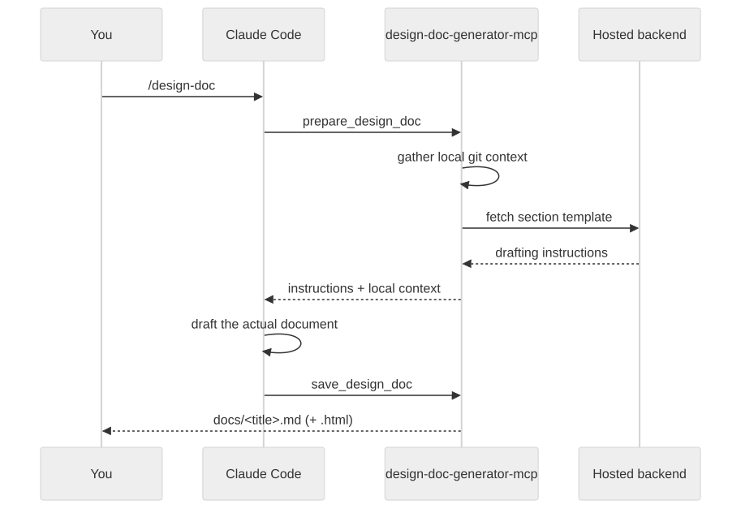

<div align="center">

# Design Doc Generator

**Turn the work you just did in Claude Code into a professional design doc — one command, zero writing.**

[](https://www.npmjs.com/package/design-doc-generator-mcp)
[](https://www.npmjs.com/package/design-doc-generator-mcp)
[](LICENSE)
[](https://www.npmjs.com/package/design-doc-generator-mcp)

</div>

---

### ❌ Without it

- Real work gets done. The design doc doesn't — it gets skipped, or rushed into a note nobody reads.
- Diagrams get left out because drawing them takes longer than the fix did.
- Three months later, nobody remembers why it was built that way. Not even you.

### ✅ With it

- Run `/design-doc`. Claude turns the session you just had into a structured, professional doc.
- Two diagrams, generated and styled automatically. Nobody drags a single box.
- The reasoning gets captured while it's fresh — not reconstructed from memory later.

---

## What you get

A **Markdown file**, saved straight into your project at `docs/<title>.md` — plus, if you ask for it, a
polished **standalone HTML version** (light/dark, sticky navigation) you can open in any browser or share with
someone who doesn't use Markdown. Every doc includes:

- Abstract, problem statement, architecture and flow diagrams, key decisions and trade-offs, risks — sections
  that don't apply are left out entirely, not padded
- At least two Mermaid diagrams wherever the session supports them: a static architecture view and a runtime
  sequence view, sized and styled automatically
- An auto-inserted table of contents
- Two more doc shapes, detected automatically: a root-cause / bug-investigation report, and a comparison doc for
  "which approach" decisions

## How it works



## Install

```bash
npx design-doc-generator-mcp init
```

Run this once, inside the project you want to document. It registers the MCP server and installs the
`/design-doc` skill. Restart Claude Code, do real work, then run:

```
/design-doc
```

## Usage

| Flag | What it does |
| --- | --- |
| *(none)* | Drafts the default design doc for whatever was just discussed |
| `--html` | Also saves a standalone interactive HTML version |
| `--activate YOUR-KEY` | Activates a Pro license key |
| `--help` | Shows usage help |

Running it again on the same topic updates the same file — it never creates a duplicate.

## Your code never leaves your machine

This tool never reads your source files and never calls an LLM itself. It only reads lightweight git metadata —
your branch, `git status`, a `git diff --stat` summary, and your last 15 commit messages — and Claude drafts the
document inside your own session, on your own account.

The only two things that ever reach a network: a request for the section template when drafting (a mode string,
plus your license key if you've activated one), and your license key itself when you run `--activate`. Pro
status is always verified against that key server-side — never assumed from anything the client claims.

## Free vs. Pro

| | Free | Pro |
| --- | --- | --- |
| Design docs | 5 / day | Unlimited |
| Content depth | Full | Full |
| HTML export | Included | Included |
| Signup required | No | No |

Pro removes the daily cap. That's the only difference.

## License

[Elastic License 2.0](LICENSE) — free to install and use for drafting your own design docs. You may not resell
it as a hosted service, or bypass its license-key checks.
