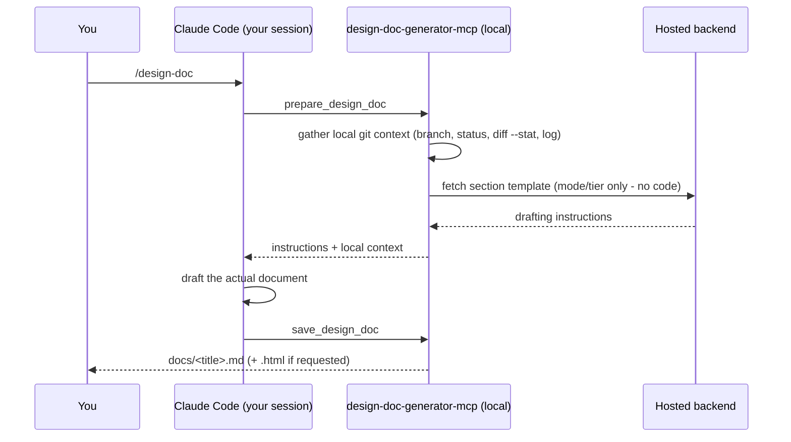

# design-doc-generator-mcp

Turn the real technical work you just did in a Claude Code session into a saved, professional design doc — one
slash command, no copy-pasting anywhere else, no signup for the free tier.



## What you get

- A properly structured design doc — abstract, problem statement, architecture & flow diagrams, key
  decisions/trade-offs, risks, and more — drafted from what you actually did, with sections that don't apply
  automatically left out. No filler.
- At least two Mermaid diagrams wherever the session supports it: a static architecture view and a
  runtime/sequence view, auto-styled for readable font size and spacing.
- A table of contents, auto-inserted.
- An optional standalone interactive HTML export — themed, light/dark, sticky navigation.
- Two other doc shapes, auto-detected from context: a root-cause/bug-investigation doc, and a
  comparison/decision doc for "which approach" discussions.

## Install

```bash
npx design-doc-generator-mcp init
```

Run this inside the project you want to document. It registers the MCP server and installs the `/design-doc`
skill. Restart Claude Code, do some real work, then run:

```
/design-doc
```

## Usage

```
/design-doc [flags]
```

| Flag | What it does |
| --- | --- |
| *(none)* | Drafts the default design doc for whatever was just discussed |
| `--html` | Also saves a standalone interactive HTML version |
| `--activate YOUR-KEY` | Activates a Pro license key |
| `--help` | Shows usage help |

The doc is saved to `docs/<title>.md` in your project. Running it again on the same topic later updates that
same file rather than creating a new one.

## Your code never leaves your machine

This tool does not read your source files. It only gathers lightweight, read-only git metadata — your current
branch, `git status` (file paths and change markers, not content), a `git diff --stat` summary (file names and
line-count totals, not the actual diff), and the last 15 commit subject lines. The document itself is drafted by
Claude, inside your own session, on your own account — this tool never calls an LLM or sends your code anywhere.

The only two things that ever reach a network: a request for the section template (a mode string, plus your
license key if you've activated one, so the backend can verify Pro status itself - never just a self-reported
label) when drafting, and your license key when you run `--activate`.

## Free vs. Pro

- **Free:** 5 design docs per day, full content depth, HTML export included — no signup required.
- **Pro:** removes the daily cap. That's the only difference right now. Pro status is verified server-side
  against your actual license key on every request - it's never taken on trust from the client.

## License

[Elastic License 2.0](LICENSE) — free to install and use for its intended purpose (drafting your own design
docs). You may not offer this software as a hosted/managed service to third parties, or circumvent its license
key checks.
